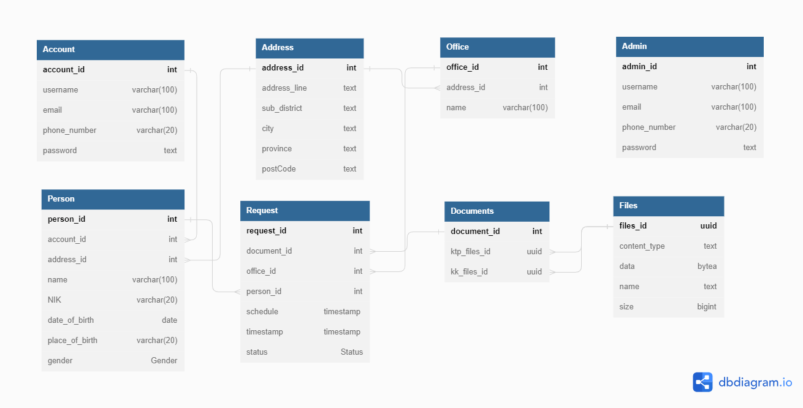
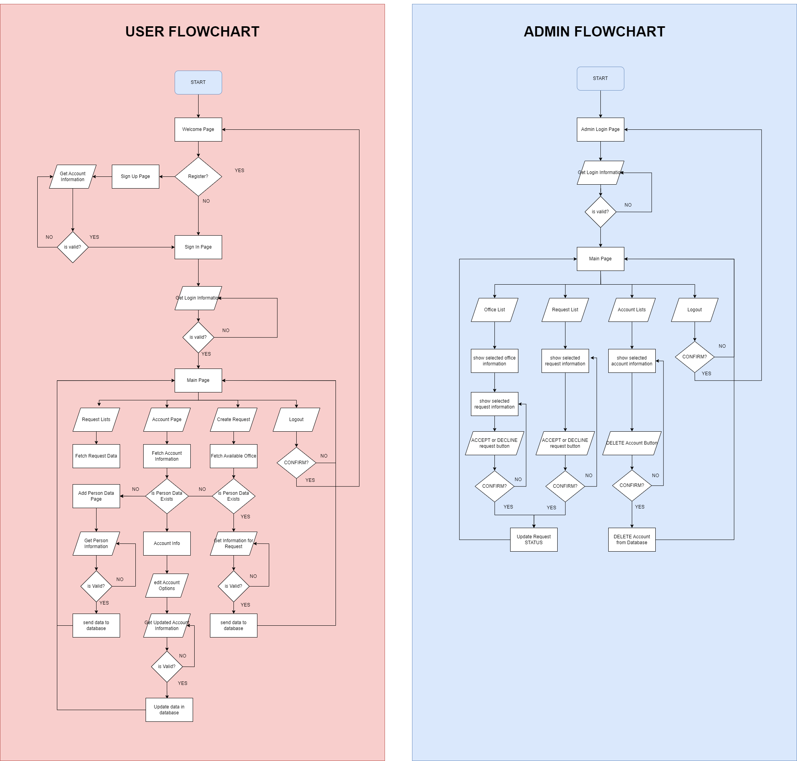

# WebPassport
WebPassport is a web application designed to simplify the process of creating online passport requests. It provides an intuitive user interface that allows users to fill out the necessary information and submit their passport applications conveniently from any device with an internet connection.


## Postman Documentation Collection
[](https://documenter.getpostman.com/view/24262220/2s93sc5ChD)


## Contributors
This is a final Database Management System project made by Group T20:
- [Farras Rafi' Permana](https://github.com/frrp16) - 2106700990
- [Fahrezy H](https://github.com/fahrezyyh) - 2106731466
- [Michael Gunawan]() - 2106731195


## Features

- **Account Management**: WebPassport provides user account management functionality, allowing users to create and manage their accounts. Users can log in to their accounts to access their saved applications and track the status of their passport requests.

- **Passport Request Tracking**: Users can track the status of their passport requests through their accounts. They receive updates on the progress of their applications, including the acceptance or rejection status.

- **Request Form**: Provides a comprehensive digital form that captures all the essential information required for a passport request.

- **Document Upload**: Users can upload scanned copies or digital photographs of the necessary documents, such as identification proofs and photographs, as part of their passport application.

- **Admin Dashboard**: The application includes an admin dashboard that allows authorized administrators to manage passport requests. Admins can review incoming passport requests, accept or reject them based on validation criteria.

## Framework & Dependencies

#### Backend
- [Java 17](https://www.oracle.com/java/technologies/javase/jdk17-archive-downloads.html)
- [Spring Boot 3.1.0](https://start.spring.io/)
- [Gradle 8.0](https://gradle.org/)
- [PostgreSQL](https://www.postgresql.org/)

#### Frontend
- [React.js](https://reactjs.org/)
- [Vite.js](https://vitejs.dev/)
- [Yarn Package Manager](https://yarnpkg.com/)
- [Sass](https://sass-lang.com/)

## Instalation
### Make Sure you have Java 17 on your machine:
```bash
java -version
```
### Clone the repository:
```bash
git clone https://github.com/SistemBasisData2023/WebPassport.git
```
### Move to backend directory:
```bash
cd Backend\WebPassport
```
### Run backend app using:

```bash
gradle bootRun
```
### or run using `jar` file by building it first. Backend process will runs on `localhost:8080`.
```bash
gradle build
java -jar .\build\libs\WebPassport-0.0.1-SNAPSHOT.jar
```
### Install frontend app dependencies:
```bash
cd Frontend\webpassport-frontend
yarn install
```
### Run frontend app, then open `localhost:5173` on your browser:
```bash
yarn run dev
```

## Tables

#### 1. ```Account```
This table stores user account information. It includes the following columns:
````
1. account_id
2. username
3. email
4. phone_number
5. password
````

#### 2. ```Admin```
This table stores information about administrators who have access to the admin pages. It includes the following columns:
````
1. admin_id
2. username
3. email
4. phone_number
5. password
````

#### 3. ```Address```
This table stores address information. It includes the following columns:
````
1. address_id
2. address_line
3. sub_district
4. city
5. province
6. postcode
````
#### 4. ```Person``` 
This table stores information about individuals. It includes the following columns:
````
1. person_id
2. account_id
3. address_id
4. name
5. nik
6. date_of_birth
7. place_of_birth
8. gender
````

#### 5. ```Office```
This table stores information about offices. It includes the following columns:
````
1. office_id
2. address_id
3. name
````

#### 6. ```Documents```
This table stores information about documents. It includes the following columns:
````
1. document_id
2. ktp_files_id
3. kk_files_id
````
#### 7. ```Request```
This table stores information about passport requests. It includes the following columns:
````
1. request_id
2. document_id
3. office_id
4. person_id
5. schedule
6. timestamp
7. status
````

#### 8. ```Files```
This table stores information about files uploaded for the passport application. It includes the following columns:
````
1. files_id
2. content_type
3. data
4. name	
5. size
````

## Database UML


## Database E/R Diagram


## Flowchart
